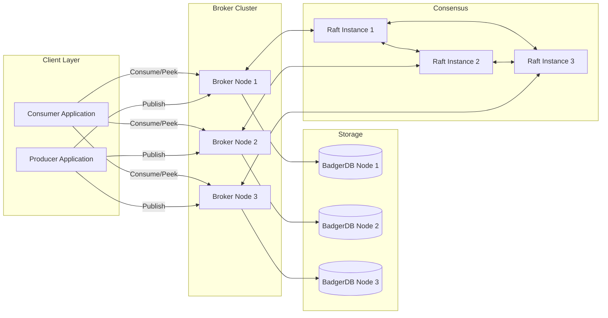
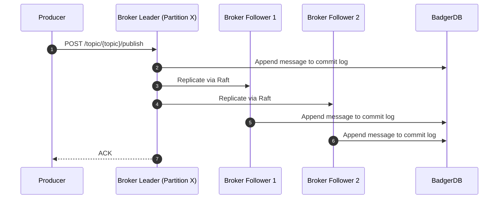
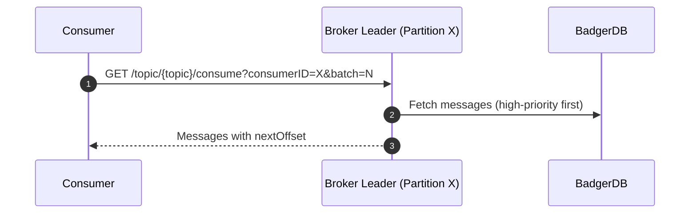

# FalconQ – Distributed Message Queue with Priority-Based Messaging


## Overview

FalconQ is a high-performance distributed message queue, built in Go, designed for environments that require both throughput and priority-aware delivery.  
Inspired by Apache Kafka and NATS, FalconQ is engineered from first principles to support **topic-based publish/subscribe**, **queue-based consumption**, **offset tracking**, **persistent commit logs**, **partitioning**, and **Raft-based replication**.

This project is intended to demonstrate production-grade distributed systems design and backend engineering capabilities.

---

## Key Capabilities

- Topic-based publish/subscribe (REST API)
- Priority queueing (high-priority messages delivered before low-priority)
- Offset-tracked consumption per consumer ID
- Persistent commit log storage using BadgerDB
- Partitioning via Consistent Hashing with Round Robin fallback
- Raft-based leader election and replication (per partition)
- Batch consumption for improved efficiency
- Administrative endpoints for topics, partitions, and Raft statistics

Planned:
- Prometheus + Grafana observability
- Chaos Mesh testing
- Sustained throughput targets of 1.5M messages/min

---

## Architecture



---

## Request Lifecycle

### Publish & Replication



### Consumption



---

## Technology Stack

| Component       | Technology        |
|-----------------|-------------------|
| Language        | Go (1.18+)        |
| REST Framework  | Gin               |
| Storage         | BadgerDB          |
| Consensus       | hashicorp/raft    |
| Observability   | Planned Prometheus + Grafana |

---

## Installation & Setup

### Prerequisites
- Go 1.18+ installed

### Clone & Install
```bash
git clone https://github.com/tejakusireddy/FalconQ-distributed-message-queue.git
cd falconq
go mod tidy
```

### Configure Cluster
Update `broker/config.yaml` with Raft and HTTP addresses for each node.

### Run Brokers
Run in separate terminals:
```bash
go run broker/main.go -config broker/config.yaml -nodeid node1
go run broker/main.go -config broker/config.yaml -nodeid node2
go run broker/main.go -config broker/config.yaml -nodeid node3
```

---

## API Reference

| Method | Route | Description |
|--------|-------|-------------|
| POST   | `/topic/{topic}/publish` | Publish message (`message`, `priority`) |
| GET    | `/topic/{topic}/consume?consumerID=X&batch=N` | Consume N messages (offset tracked) |
| GET    | `/topic/{topic}/peek?offset=X&batch=N` | Peek messages from offset |
| GET    | `/topics` | List all topics |
| GET    | `/topics/{topic}/partitions` | View partitions for a topic |

---

## Example Usage

**Publish:**
```bash
curl -X POST http://localhost:8080/topic/orders/publish -H "Content-Type: application/json" -d '{"message": "Urgent refund request #RF001", "priority": "high"}'
```

**Consume:**
```bash
curl "http://localhost:8080/topic/orders/consume?consumerID=worker1&batch=2"
```

**Peek:**
```bash
curl "http://localhost:8080/topic/orders/peek?offset=0&batch=5"
```

**Admin:**
```bash
curl http://localhost:8080/topics
curl http://localhost:8080/topics/orders/partitions
```

---

## Deployment Notes

FalconQ can be deployed in various environments:
- **Local Development:** Go processes + local BadgerDB
- **Docker Compose:** For multi-node local cluster simulation
- **Kubernetes (EKS/GKE/AKS):** For production-scale deployment with Raft peer discovery and persistent volumes

---

## Reliability & Performance

- **Data Safety:** Raft replication ensures durability across broker failures.
- **Message Ordering:** Per-partition ordering is preserved.
- **Throughput Targets:** Designed for 1.5M messages/min with horizontal scaling.
- **Fault Tolerance:** Leader election on broker failure via Raft.

---

## Development Roadmap

1. Core in-memory priority queue with REST APIs
2. Persistent commit log (BadgerDB)
3. Partitioning (Consistent Hashing)
4. Raft-based leader election & replication
5. Kubernetes deployment + Chaos Mesh testing
6. Metrics, tracing, and operational dashboard

---

## Authors

- Sai Teja Kusireddy
- Snehith Kongara

---

## License

MIT License – see LICENSE for details.
